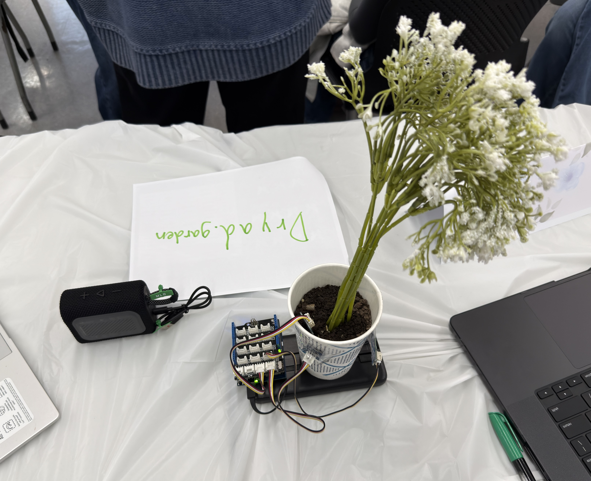
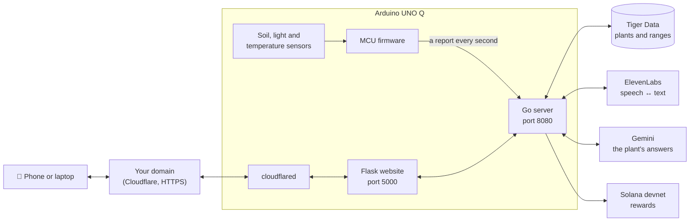
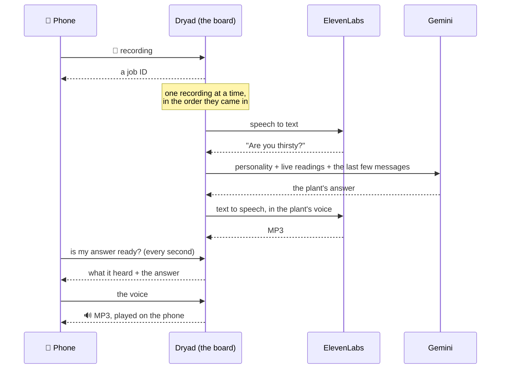
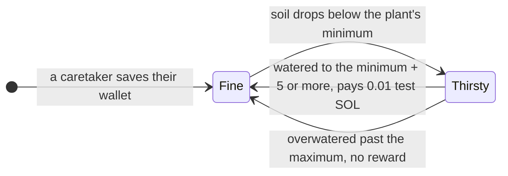
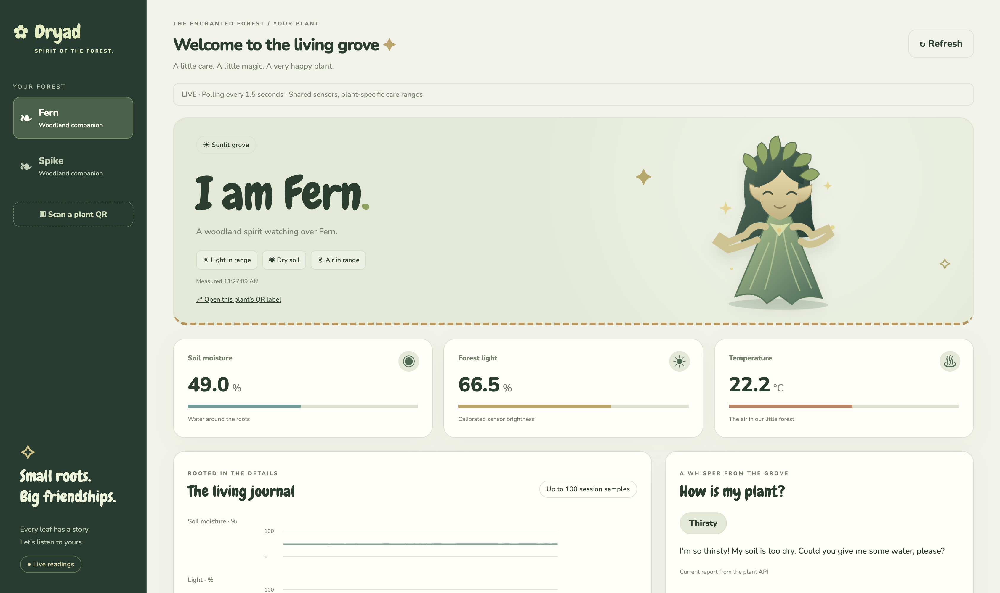
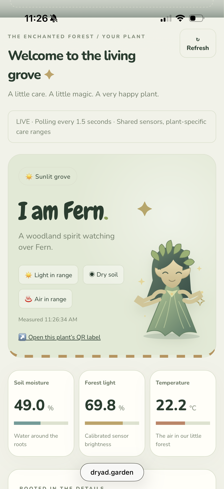

<div align="center">

# Dryad

Houseplants that tell you how they feel, and talk back.


[](LICENSE)

[Live site](https://dryad.garden) · [Devpost](https://devpost.com/software/groot-tbdcnr) · [Slides](docs/slides.pdf) · [How it works](#how-it-works) · [Getting started](#getting-started) · [Team](#team)

</div>

<details>
<summary>Contents</summary>

- [What it is](#what-it-is)
- [Features](#features)
- [The plants](#the-plants)
- [How it works](#how-it-works)
- [Getting started](#getting-started)
- [Usage](#usage)
- [API](#api)
- [Project structure](#project-structure)
- [Tech stack](#tech-stack)
- [FAQ](#faq)
- [Team](#team)
- [Credits](#credits)
- [License](#license)

</details>

## What it is

We built Dryad in 24 hours at a hackathon. A pot of soil has moisture, light
and temperature sensors wired to an Arduino UNO Q. The board's microcontroller
reads them every second, and its Linux side runs the server, the website and
the tunnel that puts the website online.

Each plant has its own healthy ranges, personality and voice. Open the site on
your phone, pick a plant or scan its QR label, and you can see how it's doing
and ask it questions out loud. Water it when it's thirsty and you get paid in
test SOL.

<p align="center"></p>

> [!NOTE]
> We built this in 24 hours, so expect rough edges. Rewards only use Solana
> devnet, where SOL has no real value.

## Features

- Live soil moisture, light and temperature, refreshed every 1.5 seconds, with charts for the session.
- Each plant's healthy ranges live in a database, so the same soil can suit the cactus and be far too dry for the fern.
- You can talk to a plant from your phone. It answers in character, knows its current readings and speaks in its own voice.
- Fern is dramatic and flowery, Spike is a deadpan cactus, and they tease each other.
- Save a Solana wallet and water a thirsty plant back into its range to get 0.01 test SOL, with a link to the transaction.
- Every plant has a printable QR label that opens its page when you scan it.
- Many phones can talk to the plants at once. Recordings wait in line, and each answer goes back to the phone that asked.
- Everything runs on the UNO Q, including the HTTPS tunnel, and one command deploys it.

## The plants

| Plant | Personality | Soil moisture | Temperature | Light | Voice |
|---|---|:-:|:-:|:-:|---|
| Fern | An expressive fern that loves humidity. It talks in a flowery way, complains about dry soil and droopy fronds, and teases Spike for being so dry. | 50-90% | 16-27 °C | 15% or more | Jessica |
| Spike | A stoic windowsill cactus with short, deadpan answers. It likes being dry and makes fun of Fern for being dramatic about water. | 5-40% | 10-35 °C | 40% or more | Adam |

The board has one set of sensors, so every plant reads the same values and
judges them against its own ranges. When several things are off, the plant
complains about the most urgent one: water first, then temperature, then light.

| Status | When | What the plant says |
|---|---|---|
| `ok` | everything is in range | "I'm feeling great! Everything is just right." |
| `thirsty` | soil below its minimum | "I'm so thirsty! My soil is too dry. Could you give me some water, please?" |
| `overwatered` | soil above its maximum | "Glub glub... my roots are drowning! Please hold off on the water for a while." |
| `cold` | below its lowest temperature | "Brrr, it's chilly in here! Could you move me somewhere warmer?" |
| `hot` | above its highest temperature | "Phew, it's way too hot! I'd love some shade or a cooler spot." |
| `dark` | less light than it needs | "It's so dark... I need more light!" |
| `offline` | no reading for 10 seconds | "I can't feel my roots right now... is my sensor board still plugged in?" |

To add a plant, add a row with its ranges to [`server/plants.sql`](server/plants.sql),
and an entry with the same `id` to [`server/personalities.json`](server/personalities.json)
with its personality and ElevenLabs voice. A plant without a personality gets a
plain one.

## How it works



1. The microcontroller samples the sensors 10 times a second. Once a second it
   sends the averages to the board's Linux side over RouterBridge, as a
   `dryad.sample` message.
2. The Go server judges each plant against its ranges from Tiger Data, works
   through the talking queue and pays the rewards.
3. The Flask website shows the plants. Cloudflare Tunnel puts it on your domain
   over HTTPS, which browsers require before a page can use the microphone.

### Talking to a plant



### Caretaker rewards



There is one caretaker at a time. The treasury wallet pays at most once a
minute, so pulling the sensor out and pushing it back in doesn't pay twice.

## Getting started

### What you need

You need an Arduino UNO Q on WiFi with a Grove Base Shield (switch at 3.3 V), a
light sensor on A0, a soil moisture sensor on A1, a Grove SPA06-003 temperature
sensor on any I2C port, and a plant.

On your computer you need Go, Python 3 with pip, `arduino-cli` with the
`arduino:zephyr` core and the `Arduino_RouterBridge` library, `adb`, `curl` and
`openssl`. The board connects over USB.

Keys go in `server/.env`. Each one turns a feature on:

| Key | Turns on | Where to get it |
|---|---|---|
| `TIGER_DATABASE_URL` | the plants (the website needs this one) | [Tiger Data](https://www.tigerdata.com/) |
| `GEMINI_API_KEY` | the plants' answers | [Google AI Studio](https://aistudio.google.com/) |
| `ELEVENLABS_API_KEY` | speech to text and the plants' voices | [ElevenLabs](https://elevenlabs.io/) |
| `SOLANA_TREASURY_KEY` | caretaker rewards | a new [Phantom](https://phantom.com/) wallet, [see below](#rewards-setup) |
| `CLOUDFLARE_TUNNEL_TOKEN` | the website on your domain, over HTTPS | Cloudflare, [see below](#domain-setup) |

### Setup

1. Clone the repo.

   ```bash
   git clone https://github.com/Iamlel/Dryad.git
   cd Dryad
   ```

2. Copy the template and fill in the keys you have. Delete the lines you
   don't fill in, because a leftover placeholder can stop the server from
   starting.

   ```bash
   cp .env.example server/.env
   ```

3. Create the plants once by running [`server/plants.sql`](server/plants.sql)
   on your database, or paste it into the SQL editor in the Tiger console. Run
   it again whenever you change it.

   ```bash
   psql "<your TIGER_DATABASE_URL>" -f server/plants.sql
   ```

4. Plug in the board and deploy.

   ```bash
   ./deploy.sh all
   ```

   This flashes the microcontroller, builds the server for the board and
   installs the website's Python packages. The board's Python has no pip, so
   those packages are built on your computer. It also downloads the page's QR
   decoder and fonts, then pushes everything and starts it. From then on it
   starts by itself whenever the board boots.

5. Open the website. The deploy prints its address on your network
   (`http://<board ip>:5000`), and once the tunnel is set up it's on your
   domain too.

<a id="rewards-setup"></a>
<details>
<summary>Set up caretaker rewards</summary>

1. Make a new wallet just for paying out (a new account in Phantom is fine) and
   export its private key. Don't use a wallet that holds real SOL, because its
   key sits in a file on the board.
2. Put `SOLANA_TREASURY_KEY=<that private key>` in `server/.env` and run
   `./deploy.sh`. `./deploy.sh logs` then shows the treasury's address.
3. Send that address some devnet SOL from <https://faucet.solana.com>. Signing
   in with GitHub raises the limit, and 1 SOL pays for about 100 rewards.

To see rewards arrive in Phantom, turn on Settings → Developer Settings → Testnet
Mode (Solana Devnet).

</details>

<a id="domain-setup"></a>
<details>
<summary>Put the website on your domain (Cloudflare Tunnel)</summary>

The tunnel connects out from the board, so it needs no public IP or open ports
and keeps working when the board's address changes. Your domain has to be on
Cloudflare.

1. In the Cloudflare dashboard, create a tunnel (Networking → Tunnels, or
   Zero Trust → Networks → Tunnels on older dashboards) and copy the token out
   of the install command it shows.
2. In the tunnel, add a published application route for your domain (or a
   subdomain) with the service URL `http://localhost:5000`.
3. Put `CLOUDFLARE_TUNNEL_TOKEN=<token>` in `server/.env` and run `./deploy.sh`,
   which waits until the tunnel is connected.

</details>

## Usage

### On the website

- Pick a plant in the sidebar, or tap Scan a plant QR and point your camera at
  its label. Each plant's page links to its printable label.
- To talk to a plant, tap Start talking, speak for up to 20 seconds and tap
  again. The answer appears in the chat and plays on your phone.
- To become the caretaker, paste your Solana wallet's public address under
  Become a grove keeper and save it. Once the plant is thirsty, water it back
  into its range, and the reward shows up in the list a few seconds later with
  a link to Solana Explorer.

<p align="center">
  
  &nbsp;
  
</p>

### On your computer

| Command | What it does |
|---|---|
| `./deploy.sh` | Rebuilds, pushes and restarts after you change server or website code |
| `./deploy.sh all` | The same, and flashes the firmware first |
| `./deploy.sh firmware` | Only flashes the firmware |
| `./deploy.sh stop` | Stops everything. It stays off, even after a reboot, until the next `./deploy.sh` |
| `./deploy.sh logs` | Follows the server, website and tunnel logs |
| `./deploy.sh watch` | Prints the live sensor readings once a second |
| `firmware/baseline.sh moisture 10` | Averages a sensor (`light`, `moisture`, `temp` or `all`) for 10 seconds, for calibrating it in [`firmware/dryad_config.h`](firmware/dryad_config.h) |
| `cd server && go run .` | Starts a chat with the plants in your terminal. Type to them, use `/voice` to talk through your Mac's microphone, or `/model` to switch to a local LM Studio model |

<details>
<summary>Run it on your computer instead</summary>

The Go server can read the board's sensors over USB. Stop the board's own copy
first with `./deploy.sh stop`, then:

```bash
adb forward tcp:7600 localfilesystem:/var/run/arduino-router.sock
cd server
DRYAD_ROUTER=tcp:localhost:7600 go run . -headless
```

And the website, in another terminal:

```bash
cd frontend
python3 -m pip install -r requirements.txt
python3 app.py          # http://localhost:5000
```

Tests:

```bash
(cd server && go test ./...)      # the AI tests talk to Gemini and LM Studio when they're set up
(cd frontend && python3 -m unittest discover -s tests)
```

</details>

## API

The Go server's API is on port 8080 of the board. The website passes the same
`/api/...` routes through on port 5000, where `/healthz` checks the website and
`/api/backend-health` checks the API.

<details>
<summary>Endpoints</summary>

Percentages are 0-100 and temperatures are in °C. A value is `null` when that
sensor has no reading. Errors are JSON, `{"error": "..."}`, with a matching
status code.

| Endpoint | What it does |
|---|---|
| `GET /api/plants` | Every plant, with its ranges. |
| `GET /api/plant/{id}` | The plant's `moisture_pct`, `temperature_c` and `light_pct`, its `status` (`ok`, `thirsty`, `overwatered`, `cold`, `hot`, `dark` or `offline`), a `dialog` line, `stale` and `updated_at`. `GET /api/plant` does the same with default houseplant ranges. |
| `GET /api/sensors` | The latest raw reading. |
| `GET /api/caretaker` | The caretaker's `wallet` and `plant_id`, and the `payouts` sent so far (newest first), each with an `explorer_url`. |
| `POST /api/caretaker` | Sets who gets the watering rewards: `{"wallet": "<Solana address>", "plant_id": "fern"}`. Without `plant_id`, the default ranges judge the watering. The server keeps it in memory, so send it again after a restart. |
| `POST /api/talk/{id}` | A voice recording for the plant (the request body, as the browser recorded it). Answers `202 {"job": "..."}`, or `503` when 20 are already waiting. |
| `GET /api/talk/jobs/{job}` | `{"status": "queued", "position": 2}` (recordings ahead of it), `{"status": "working"}`, `{"status": "done", "heard": "...", "answer": "...", "voice": true}` or `{"status": "failed", "error": "..."}`. Answers are kept for 5 minutes. |
| `GET /api/talk/jobs/{job}/voice` | The answer in the plant's voice, as MP3. |
| `GET /healthz` | Liveness and the deployed version. |

</details>

## Project structure

```text
Dryad/
├── deploy.sh                 builds, pushes and runs everything on the board
├── deploy/keep-running.sh    runs on the board and restarts anything that stops
├── .env.example              the keys server/.env takes
├── docs/                     photos, screenshots and the slides
├── firmware/                 the microcontroller's sketch
│   ├── firmware.ino          samples the sensors and sends a report every second
│   ├── dryad_config.h        pins, calibration, timing and the report format
│   ├── spa06.c, spa06.h      driver for the SPA06-003 temperature sensor
│   ├── run.sh                flashes the sketch and shows its serial output
│   └── baseline.sh           averages a sensor, for calibration
├── server/                   the Go server
│   ├── main.go               starts the plant server (-headless) or the terminal chat
│   ├── httpapi.go            the HTTP API on port 8080
│   ├── talk.go               the talking queue: recording → text → answer → voice
│   ├── ai/                   Gemini and LM Studio, personalities, ElevenLabs voices
│   │                         and speech to text, the Mac microphone, API keys
│   ├── sensors/              receives the microcontroller's reports
│   ├── plants/               plant profiles from Tiger Data and their status
│   ├── rewards/              caretaker rewards on Solana devnet
│   ├── cmd/test_stt/         checks that an ElevenLabs key can do speech to text
│   ├── personalities.json    each plant's personality, voice and memories
│   └── plants.sql            the plants table and each plant's ranges
└── frontend/                 the website
    ├── app.py                the pages, and a gateway to the Go API
    ├── serve.py              runs it in production (Waitress)
    ├── templates/            the page
    ├── static/               its script, styles and the dryad artwork
    ├── tests/                tests for the gateway
    └── hosting/              a Caddy example, for hosting it somewhere else
```

## Tech stack

| | |
|---|---|
| Hardware | Arduino UNO Q, Grove Base Shield, light and soil moisture sensors, SPA06-003 temperature sensor |
| Firmware | Arduino on Zephyr, RouterBridge (MessagePack-RPC through `arduino-router`) |
| Server | Go, with pgx, solana-go, elevenlabs-go and generative-ai-go |
| Website | Python, Flask and Waitress, with plain JavaScript and CSS |
| Services | Tiger Data (Postgres), Google Gemini, ElevenLabs, Solana devnet, Cloudflare Tunnel |

## FAQ

<details>
<summary>Does it use real money?</summary>

No. The server only talks to Solana devnet, where SOL is free test money.

</details>

<details>
<summary>Why did my saved wallet disappear?</summary>

The server keeps the caretaker in memory, and every deploy restarts it. Save
the wallet again.

</details>

<details>
<summary>Why won't the microphone or camera turn on?</summary>

Browsers only allow them on HTTPS or localhost, so open the site on your domain
instead of the board's IP address. You can also type a plant's ID instead of
scanning its label.

</details>

<details>
<summary>Does each plant have its own sensors?</summary>

No. Every plant reads the same sensors and judges the values against its own
ranges, so the same soil can make Fern thirsty while Spike is fine.

</details>

<details>
<summary>What happens when lots of people talk at once?</summary>

Up to 20 recordings wait in line and get answered one at a time. The page shows
your place in line, and only your phone gets your answer.

</details>

<details>
<summary>Why "Dryad"?</summary>

In Greek myth, a dryad is the spirit of a tree. Ours lives on a circuit board.

</details>

## Team

| Who | What they did |
|---|---|
| Konain | The frontend |
| [Yuvaraaj Murthy](https://github.com/yuvaraajmurthy) | Got all the APIs working, built the server and made the slideshow |
| [Iamlel](https://github.com/Iamlel) | The firmware, merging everything together and finishing the server |
| Aarav | Logistics for the project and the Devpost |

## Credits

Dryad uses these libraries and tools:

- Go: [solana-go](https://github.com/gagliardetto/solana-go), [pgx](https://github.com/jackc/pgx), [elevenlabs-go](https://github.com/plexusone/elevenlabs-go), [generative-ai-go](https://github.com/google/generative-ai-go), [msgpack](https://github.com/vmihailenco/msgpack) and [gorilla/websocket](https://github.com/gorilla/websocket)
- Python: [Flask](https://flask.palletsprojects.com/), [Waitress](https://docs.pylonsproject.org/projects/waitress/), [Requests](https://requests.readthedocs.io/), [python-dotenv](https://github.com/theskumar/python-dotenv) and [qrcode](https://github.com/lincolnloop/python-qrcode)
- Website: [jsQR](https://github.com/cozmo/jsQR), and the [Chewy](https://fonts.google.com/specimen/Chewy) and [Nunito](https://fonts.google.com/specimen/Nunito) fonts through [Fontsource](https://fontsource.org/)
- Board: Arduino's Zephyr core and RouterBridge, and [cloudflared](https://github.com/cloudflare/cloudflared)

## License

Dryad is licensed under the [GNU General Public License v3.0](LICENSE).

<p align="right"><a href="#top">Back to top</a></p>
